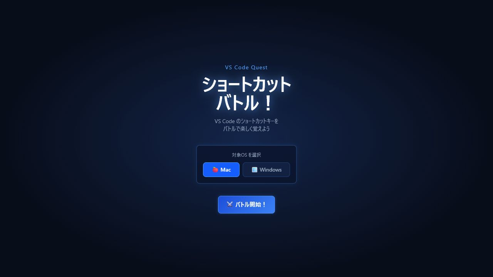
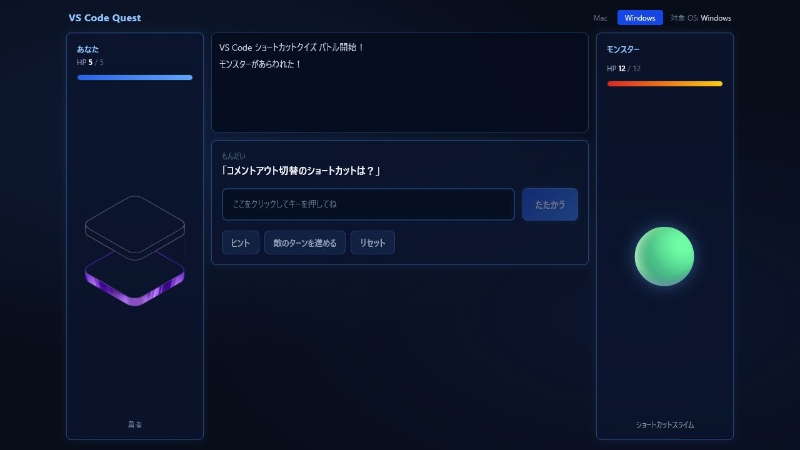
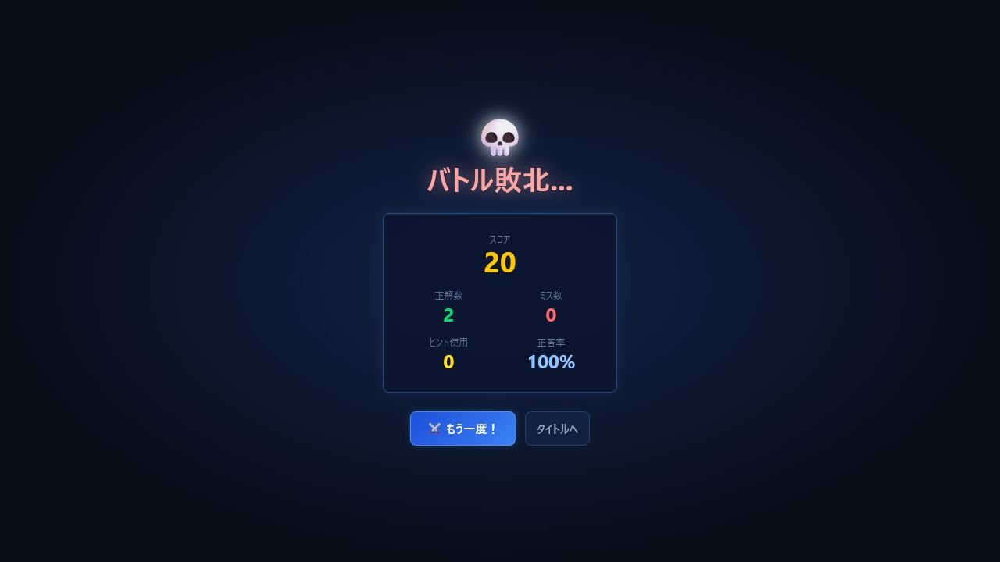

# VS Code Quest - ショートカットバトル

VS Code のショートカットキーを、RPG 風のバトルで学べるクイズアプリです。

開発イベントで 2 名のチームが制作した、ローカル環境で動作するプロトタイプです。Mac / Windows を選択し、出題された操作に対応するショートカットキーを実際に入力してモンスターと戦います。

## 画面

### タイトル



### バトル



### リザルト



## 主な機能

- Mac / Windows の対象 OS 選択
- 問題データからのランダム出題
- 実際のキー操作によるショートカット入力
- API による正誤判定と 2 段階のヒント
- HP、ダメージ、スコアを使った RPG 風のバトル進行
- 正解数、ミス数、ヒント使用数、正答率のリザルト表示
- SQLite への回答進捗・リザルト保存

## チーム体制と担当範囲

| 担当 | 実装範囲 |
| --- | --- |
| 瀧井（フロントエンド） | React / TypeScript / Vite の画面基盤、タイトル・バトル・リザルト画面、RPG 風 UI、ショートカットキー入力、Zustand による状態管理、FastAPI との API 連携 |
| もう 1 名（バックエンド） | FastAPI のエンドポイント、問題データ、ショートカットの正規化・判定、SQLite への進捗・結果保存、API 仕様と接続設定の調整 |

担当範囲は、現在のコードとコミット履歴で確認できた内容に限定しています。フロントエンドとバックエンドを分担し、API 仕様を介して結合した履歴を確認できます。

## 使用技術

| 区分 | 技術 |
| --- | --- |
| フロントエンド | React 19、TypeScript 6、Vite 8、React Router 7、Zustand 5、Tailwind CSS 4 |
| バックエンド | Python、FastAPI 0.115.0、Pydantic 2.9.2、Uvicorn 0.30.6 |
| データ・永続化 | JSON、SQLite |
| 品質確認 | ESLint、TypeScript Compiler |

## ローカルでの起動方法

### 前提環境

- Node.js `20.19.0` 以上、または `22.12.0` 以上
- npm
- Python 3.10 以上

### 1. バックエンド

リポジトリ直下で実行します。

#### Windows PowerShell

```powershell
python -m venv backend\.venv
.\backend\.venv\Scripts\python.exe -m pip install -r backend\requirements.txt
.\backend\.venv\Scripts\python.exe -m uvicorn backend.main:app --reload
```

#### macOS / Linux

```bash
python3 -m venv backend/.venv
./backend/.venv/bin/python -m pip install -r backend/requirements.txt
./backend/.venv/bin/python -m uvicorn backend.main:app --reload
```

### 2. フロントエンド

別のターミナルで実行します。

```bash
cd frontend
npm ci
npm run dev
```

### URL

- フロントエンド：`http://localhost:5173`
- API：`http://127.0.0.1:8000`
- API ドキュメント：`http://127.0.0.1:8000/docs`

Vite の開発サーバーは `/api` と `/health` をローカルの FastAPI へ転送します。別の API を利用する場合は、`VITE_API_BASE_URL` を設定します。

## 操作方法

1. タイトル画面で Mac または Windows を選択します。
2. 「バトル開始！」を押します。
3. 入力欄をクリックし、回答となるショートカットキーを押します。
4. 「たたかう」を押して判定結果を確認します。
5. 正答やヒントを使いながらバトルを進め、リザルトを確認します。

## 確認済み

- `npm ci`
- `npm run build`
- `npm run lint`
- タイトル表示、OS 選択、問題取得、キー入力、正誤判定、ヒント、次問遷移、リザルト表示
- フロントエンドとバックエンドの API 連携、SQLite への結果保存

## 現在の位置づけ

本リポジトリは、開発イベントで制作したローカル動作前提のプロトタイプです。ライブ公開は行っておらず、認証、公開環境向けの CORS・永続化設計、自動テストは未整備です。本番運用を想定したものではありません。
